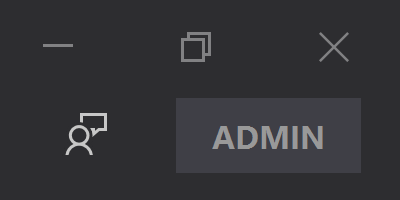

# NanaZip Sponsor Edition

NanaZip provides a $99.99 USD Sponsor Edition addon to the Microsoft Store to 
attract more sponsors and contributors.

It's free for NanaZip source code repository contributors and NanaZip sponsors
who sponsored before March 30, 2024.

## Feature

The only difference for NanaZip Sponsor Edition is showing "Appreciate your
sponsorship" button instead of "Sponsor NanaZip" button in the next
stable version of NanaZip's toolbar like the Visual Studio administrator mode.

## Purpose

We hope every NanaZip user is happier than before. Here is why we offer a
sponsored version:

- Most users: We are happy with using a $99.99 product freely without feature 
  differences.
- Contributors: We want to show "Appreciate your sponsorship" button to 
  others. It's free because we are the contributors. Contribute it if you want
  to get that free.
- Sponsors: You can show "Appreciate your sponsorship" button to others
  because sponsors deserve that.
- The author of NanaZip, Kenji Mouri: Finally, NanaZip has a price. Nobody 
  will think this is a worthless product. Efforts from contributors and I should
  have value even NanaZip is a fully free and open source project.

## Notes for NanaZip source code repository contributors

If you are the contributor of NanaZip source code repository, please contact
with Kenji.Mouri@outlook.com for more information.

Note: If you are the contributor of Project Mile projects which is used in
NanaZip, you are eligibled too. I think I have sent e-mails or QQ message 
to all eligible Project Mile contributors.

## Notes for NanaZip sponsors who sponsored before March 30, 2024

I think I have sent e-mails or QQ message to all eligible NanaZip sponsors.

Contact with Kenji.Mouri@outlook.com for more information.
