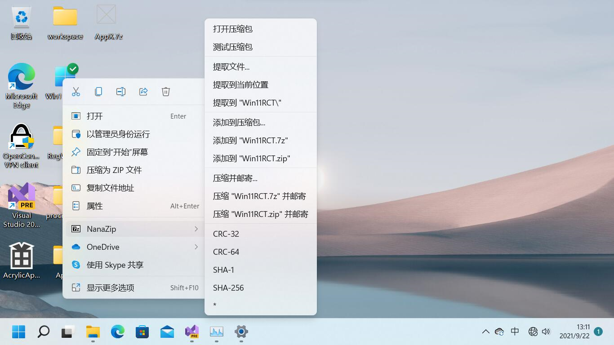
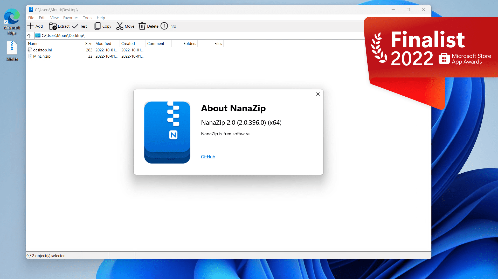

#  NanaZip

NanaZip is an open source file archiver intended for the modern Windows 
experience, forked from the source code of well-known open source file archiver
7-Zip.

**All kinds of contributions will be appreciated. All suggestions, pull 
requests and issues are welcome.**

## Features

- Inherit all features from 7-Zip 21.07.
- Packaging with MSIX for modern deployment experience.
- Support the context menu in Windows 10/11 File Explorer.
- Enable NSIS script decompiling support for the NSIS archives. (Merged from 
  [7-Zip NSIS branch](https://github.com/myfreeer/7z-build-nsis).)
- Provide 7-Zip execution alias for helping users to migrate to NanaZip.
- Support the Brotli, Fast-LZMA2, Lizard, LZ4, LZ5 and Zstandard codecs. (Merged 
  from [7-Zip ZS branch](https://github.com/mcmilk/7-Zip-zstd).)
- Support the Per-Monitor DPI-Aware for all GUI components.
- Support the i18n for GUI edition of Self Extracting Executable.

## System Requirements

- Supported OS: Windows 10, version 1809 or later
- Supported Platforms: x86, x86-64(AMD64) and ARM64.

## Download and Installation

Here are some available installation methods for NanaZip.

### Microsoft Store

This is the recommended way to install NanaZip.

Search and install `NanaZip` in Windows Store for stable release, and `NanaZip
Preview` for preview release.

Also, you can also click the Microsoft Store link you needed.

- [NanaZip](https://www.microsoft.com/store/apps/9N8G7TSCL18R)
- [NanaZip Preview](https://www.microsoft.com/store/apps/9NZL0LRP1BNL)

### MSIX Package

You also can download the MSIX Package in 
[GitHub Releases](https://github.com/M2Team/NanaZip/releases).

After you have downloaded the MSIX Package, you can double click to install it,
or you can execute the following command in the Command Prompt which is run as the Administrator.

> PowerShell -NoLogo -NoProfile -NonInteractive -InputFormat None -ExecutionPolicy Bypass Add-AppxPackage -DeferRegistrationWhenPackagesAreInUse -ForceUpdateFromAnyVersion -Path `The path of the MSIX package`

P.S. All needed dependencies are included in the MSIX Package of NanaZip 
because we known that it's very difficult for users who do not have access to 
the store to get our dependency packages, and we want to be robust and 
deployable everywhere.

## Known issues

- If you can't find NanaZip in the context menu, please restart all File 
  Explorer processes via Task Manager.
- Due to the issues in Desktop Bridge file system virtualization, you are 
  unable to use NanaZip in the Safe Mode of Windows.
- Due to the policy from Microsoft Store, NanaZip is unable to disable Desktop 
  Bridge file system virtualization, so the file operations in 
  `%UserProfile%/AppData` will be redirected in Windows 10, and file operations
  in directories other than `Local`, `LocalLow` and `Roaming` in 
  `%UserProfile%/AppData` will still be redirected in Windows 11.
- Due to the Microsoft Store limitations, NanaZip 1.1 Servicing Update 1 and 
  later won't support languages not mentioned in 
  https://docs.microsoft.com/en-us/windows/uwp/publish/supported-languages.

## Development Roadmap

- 1.0 (December 8, 2021)
  - [x] Modernize the build toolchain with MSBuild for using MSIX packaging and
        parallel compilation support.
  - [x] Use [VC-LTL 5.x](https://github.com/Chuyu-Team/VC-LTL5) toolchain to 
        make the binary size even smaller than the official 7-Zip because we
        can use ucrtbase.dll directly and the optimizations from modern compile
        toolchain.
  - [x] Add the context menu support in Windows 10/11 File Explorer.
  - [x] New icons and minor UI tweaks.
  - [x] Merge NSIS script decompiling support from 
        [7-Zip NSIS branch](https://github.com/myfreeer/7z-build-nsis).
        (Suggested by alanfox2000.)
  - [x] Provide 7-Zip execution alias for helping users to migrate to NanaZip. 
        (Suggested by AndromedaMelody.)
  - [x] Add support for Brotli, Fast-LZMA2, Lizard, LZ4, LZ5 and Zstandard
        from [7-Zip ZS branch](https://github.com/mcmilk/7-Zip-zstd). (Suggested
        by fcharlie.)
- 1.1 (March 17, 2022)
  - [x] Add assembly implementations from 7-Zip back for improving performance.
  - [x] Reimplement the about dialog with Task Dialog.
  - [x] Modernize the message boxes with Task Dialog.
- 1.2 (2022 Q2)
  - [x] Add Per-Monitor DPI-Aware support for Self Extracting Executables.
  - [x] Modernize the i18n implementation and migrate language files from 
        `.txt`  to `.resw`. (Suggested by Maicol Battistini.)
  - [x] Add i18n support for Self Extracting Executables.
- 2.x Series (2023 Q3)
  - [ ] Add the UI stack based on XAML Islands which is used in NanaZip.
  - [ ] Modernize the UI with XAML Islands with the Windows 11 control style, 
        Mica material, dark and light mode support.
  - [ ] Full High DPI and Accessibility support in all UI components.
  - [ ] Migrate configurations from registry to json. (Suggested by 
        AndromedaMelody.)
  - [ ] Try to modernize the core implementation.
  - [ ] Try to Windows Runtime component for interoperability.
  - [ ] Provide NanaZip Installer for simplify the deployment.
- 3.x Series (2024 Q3)
  - [ ] Try to add option for save file names with UTF-8 in 7z archives.
  - [ ] Try to add extension for Windows File Explorer for give user immersive 
        experience. (Suggested by SakuraNeko and shuax.)
  - [ ] Add batch task support. (Suggested by 刘泪.)
  - [ ] Try to design the new UI layout. (Suggested by wangwenx190.)
  - [ ] Try to add option for using Windows Imaging API (WIMGAPI) backend to 
        make better creation and extraction support for wim archives, also add 
        creation and extraction support for esd archives.
  - [ ] Try to add pri archive extracting support.
  - [ ] Try to add smart extraction.
  - [ ] Try to add language encoding switching support for file names in File
        Manager. (Suggested by 刘泪 and zjkmxy.)
  - [ ] Try to add deleting source after archiving support. (Suggested by 
        OrionGrant.)
  - [ ] Try to add an option when extracting an archive to open the folder 
        where you extracted the files, like WinRAR. (Suggested by maicol07.)
- 5.x Series (2025 Q3)
  - [ ] Try to add recovery record support for 7z archives. (Suggested by 
        SakuraNeko.)
  - [ ] Try to create a new archive format for Windows imaging.
  - [ ] Try to add ISO creation support.

## Documents

- [License](License.md)
- [Relevant People](Documents/People.md)
- [Privacy Policy](Documents/Privacy.md)
- [Code of Conduct](CODE_OF_CONDUCT.md)
- [Contributing Guide](CONTRIBUTING.md)
- [NanaZip Release Notes](Documents/ReleaseNotes.md)
- [NanaZip Preview Release Notes](Documents/ReleaseNotesPreview.md)
- [Versioning](Documents/Versioning.md)
- [My Digital Life Forums](https://forums.mydigitallife.net/threads/84171)
