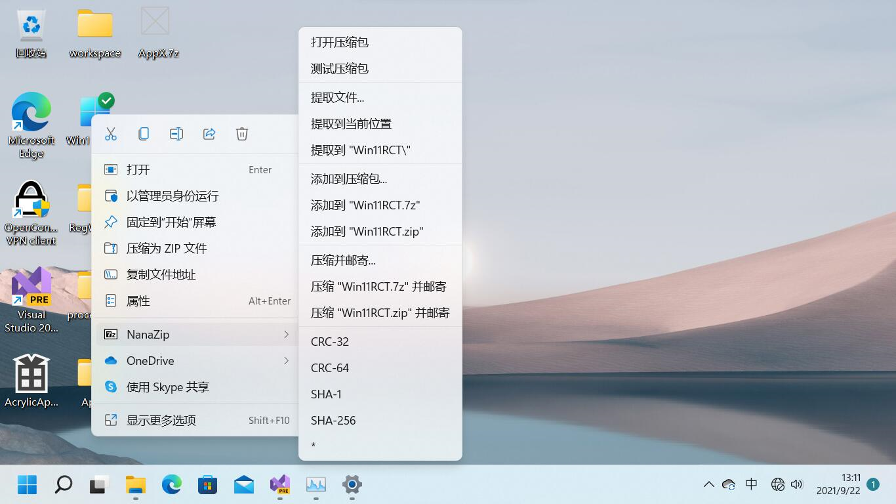
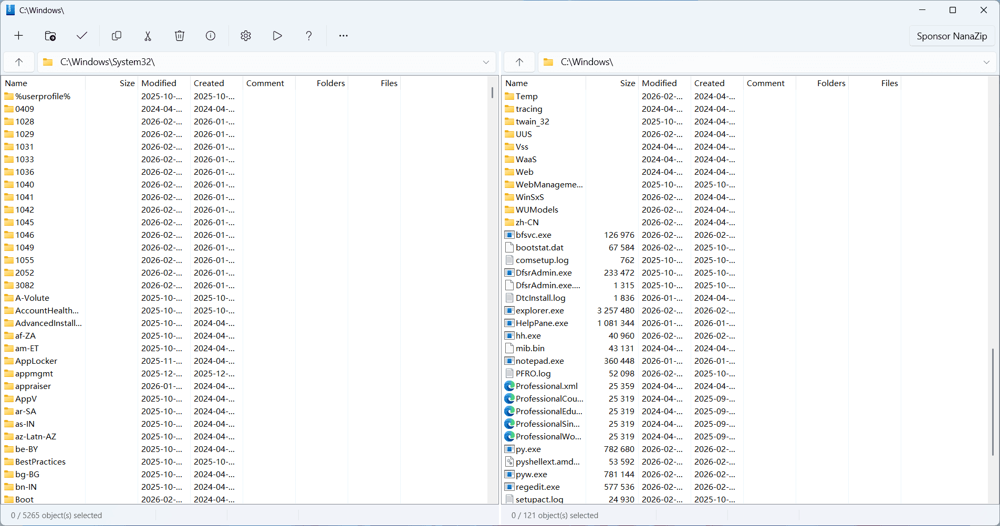
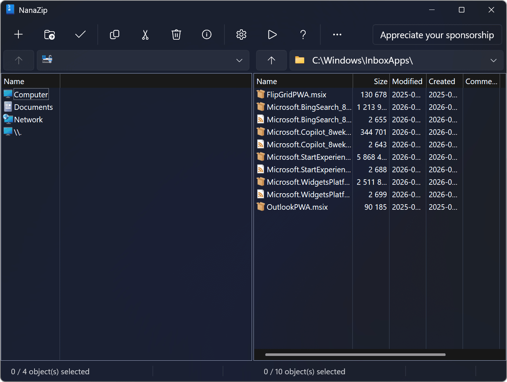

#  NanaZip

NanaZip is an open source file archiver intended for the modern Windows
experience, forked from the source code of well-known open source file archiver
7-Zip.

**All kinds of contributions will be appreciated. All suggestions, pull
requests, and issues are welcome.**

If you want to sponsor the development of NanaZip, please read the document of
[NanaZip Sponsor Edition](Documents/SponsorEdition.md). It's free for all
NanaZip source code repository contributors.

In general, NanaZip Sponsor Edition is more like contributor's edition, but
we provide a way to buy the honor and make someone look like a source code
contributor, because NanaZip is always a community-friendly open-source project.

If you'd like me to add features or improvements ahead of time, please use
[paid services](https://github.com/MouriNaruto/MouriNaruto/blob/main/PaidServices.md).

Besides NanaZip.org, NanaZip's official project pages are only hosted on GitHub,
Microsoft Store, My Digital Life Forums, SourceForge, and Windows App Community.

Kenji Mouri

## Features

- Inherit all features from 7-Zip 26.00, [7-Zip ZS] and [7-Zip NSIS].
- Support the dark mode for all GUI components.
- Support the Mica effect on the main window. You will enjoy the full window
  immersive Mica for all GUI components if you are using dark mode with HDR
  disabled.
- Packaging with MSIX for modern deployment experience.
- Support the context menu in Windows 10/11 File Explorer.
- Provide 7-Zip execution alias for helping users to migrate to NanaZip.
- Support the Per-Monitor DPI-Aware for all GUI components.
- Support the i18n for GUI edition of Self Extracting Executable.
- Modernize message boxes and folder browsers.
- Provide the Smart Extraction feature.
- Provide the Open folder after extraction option.
- Provide the policy mechanism for enforcing settings (see
  [Policies.md](/Documents/Policies.md) for details)
- Propagates Mark-of-the-Web to all files by default.
- Provide additional hash algorithms.
  - MD2 (Inherit from 7-Zip ZS, but reimplemented with Windows CNG API)
  - MD4 (Inherit from 7-Zip ZS, but reimplemented with Windows CNG API)
  - MD5 (Inherit from 7-Zip, but reimplemented with Windows CNG API)
  - SHA-1 (Inherit from 7-Zip, but reimplemented with Windows CNG API)
  - SHA-256 (Inherit from 7-Zip, but reimplemented with Windows CNG API)
  - SHA-384 (Inherit from 7-Zip, but reimplemented with Windows CNG API)
  - SHA-512 (Inherit from 7-Zip, but reimplemented with Windows CNG API)
  - ED2K (Implemented with Windows CNG API)
  - AICH (Implemented with RHash)
  - BLAKE2b (Implemented with RHash)
  - BTIH (Implemented with RHash)
  - EDON-R 224 (Implemented with RHash)
  - EDON-R 256 (Implemented with RHash)
  - EDON-R 384 (Implemented with RHash)
  - EDON-R 512 (Implemented with RHash)
  - GOST R 34.11-94 (Implemented with RHash)
  - GOST R 34.11-94 CryptoPro (Implemented with RHash)
  - GOST R 34.11-2012 256 (Implemented with RHash)
  - GOST R 34.11-2012 512 (Implemented with RHash)
  - HAS-160 (Implemented with RHash)
  - RIPEMD-160 (Implemented with RHash)
  - SHA-224 (Implemented with RHash)
  - SHA3-224 (Inherit from 7-Zip, but reimplemented with RHash)
  - SHA3-256 (Inherit from 7-Zip, but reimplemented with RHash)
  - SHA3-384 (Inherit from 7-Zip, but reimplemented with RHash)
  - SHA3-512 (Inherit from 7-Zip, but reimplemented with RHash)
  - Snefru-128 (Implemented with RHash)
  - Snefru-256 (Implemented with RHash)
  - Tiger (Implemented with RHash)
  - Tiger2 (Implemented with RHash)
  - BTIH (Implemented with RHash)
  - TTH (Implemented with RHash)
  - Whirlpool (Implemented with RHash)
  - XXH32 (Implemented with xxHash)
  - XXH64 (Implemented with xxHash)
  - XXH3_64bits (Implemented with xxHash)
  - XXH3_128bits (Implemented with xxHash)
  - SM3 (Implemented with GmSSL)
- Provide additional codecs. (Note: Decoder can be considered as decompression
  support, Encoder can be considered as compression support, and Archiver can be
  considered as archive format support)
  - Brotli (Decoder & Encoder & Archiver, inherited from 7-Zip ZS)
  - Fast-LZMA2 (Encoder, inherited from 7-Zip ZS)
  - Lizard (Decoder & Encoder & Archiver, inherited from 7-Zip ZS)
  - LZ4 (Decoder & Encoder & Archiver, inherited from 7-Zip ZS)
  - LZ5 (Decoder & Encoder & Archiver, Both inherited from 7-Zip ZS)
  - Zstandard (Decoder inherited from 7-Zip, Encoder & Archiver inherited from
    7-Zip ZS)
  - NSIS (Decoder's NSIS script decompiling support, inherited from 7-Zip NSIS)
  - UFS/UFS2 file system image (Archiver, read-only, both big and little endian)
  - .NET Single File Application bundle (Archiver, read-only, extracting
    compressed files in the bundle are not supported)
  - Electron Archive (asar) (Archiver, read-only)
  - ROMFS file system image (Archiver, read-only)
  - ZealFS file system image (Archiver, read-only)
  - WebAssembly (WASM) binary file (Archiver, read-only)
  - littlefs file system image (**Work In Progress**) (Archiver, only block
    information can acquired)
- Provide additional security mitigations.
  - Enable Control Flow Guard (CFG) to all target binaries for mitigating ROP
    attacks.
  - Mark all x86 and x64 target binaries as compatible with Control-flow
    Enforcement Technology (CET) Shadow Stack.
  - Strict handle checks at runtime to block the use of invalid handles.
  - Disable dynamic code generation in Release builds prevents generating
    malicious code at runtime.
  - Block loading unexpected libraries from remote sources at runtime.
  - Enable Package Integrity Check.
  - Enable EH Continuation Metadata.
  - Enable Signed Returns.
  - Enable disabling child process creation for NanaZip CLI and Self Extracting
    Executables. (Except installer mode of Self Extracting Executables, which
    compiled binaries is not provided in the NanaZip MSIX package.)
- Various UI bug fixes and enhancements.

[7-Zip ZS]: https://github.com/mcmilk/7-Zip-zstd
[7-Zip NSIS]: https://github.com/myfreeer/7z-build-nsis

## Differences between NanaZip and NanaZip Classic

NanaZip plans to have two distribution flavors called NanaZip and NanaZip
Classic. Here are the differences between them.

- NanaZip (Modern)
  - Only MSIX packaged version.
  - Support the context menu in Windows 10/11 File Explorer.
  - Support the file associations.
  - Provide 7-Zip execution alias for helping users to migrate to NanaZip.
  - XAML-based GUI.

- NanaZip Classic (**Work In Progress**)
  - Only portable version which is suitable for Server Core, Windows PE, Windows
    RE, and Wine.
  - Don't have the context menu support.
  - Don't have the file associations support.
  - Don't have the 7-Zip execution alias support.
  - Win32 GUI.

> [!CAUTION]
> NanaZip can be used as portable version if you use the official portable
> release package. It's designed for debugging/testing/development purpose and
> scenarios (a.k.a. Server Core, Windows PE, Windows RE, and Wine) really need
> portable version. But please note that some features is not available, such as
> context menu and file associations. Some issues will not be fixed if you are
> using NanaZip in portable mode.

> [!CAUTION]
> We don't provide any support for users if they are using any non-official
> release packages, such as extracting the files from the MSIX package or copy
> from the NanaZipPackage project output. For example, if you are using the
> files extracted from the MSIX package of NanaZip like Scoop package manager
> does. We hugely recommend you to use the official release packages of NanaZip.
> For example, WinGet package manager uses NanaZip official release package to
> install NanaZip.

## System Requirements

Here are the system requirements starting with NanaZip 6.0:

- Supported Operating Systems:
  - Windows 10, version 2004 (Build 19041) or later
  - Windows Server 2022 (Build 20348) or later
- Supported Platforms:
  - x86 (64-bit)
  - ARM (64-bit)

In general, NanaZip follows the 2025 baseline defined by Kenji Mouri's document,
read [MD23: The baselines of Windows targets for all my open-source projects]
for more information.

[MD23: The baselines of Windows targets for all my open-source projects]: https://github.com/MouriNaruto/MouriDocs/tree/main/docs/23

Note: Due to the Self Extracting Executables (SFX) will be migrated to x86
(64-bit) starting with NanaZip 6.0, it gives users chances to use Self
Extracting Executables (SFX) archives under 64-bit Microsoft official Windows
PE and Windows RE instances:

- For ARM (64-bit) Microsoft official Windows PE and Windows RE, you need to
  make sure you Windows PE and Windows RE images are built with Windows ADK
  Build 25398 or later and integrated the [x64 emulation optional component].
- For ARM (64-bit) Windows 10, I suggest you to upgrade to Windows 11 because
  ARM (64-bit) Windows 11 provides x64 emulation support, and Windows 10 is
  nearly end of support from Microsoft.

[x64 emulation optional component]: https://learn.microsoft.com/en-us/windows-hardware/manufacture/desktop/winpe-add-packages--optional-components-reference?#32

We chose Windows as the major platform for the NanaZip project supported
because Windows has maintained a good and proven ABI and compatibility, and
stands out in the history of computing. But we also care about the non-Windows
platform. Here are the policy for non-Windows platform support:

- The modern flavor of NanaZip won't support non-Windows unless someone ported
  WinRT XAML to POSIX. So, non-Windows support policy is only for NanaZip Core
  and NanaZip Classic.
- The developer team will try best to support Wine which has the Windows Vista
  or later feature level. Currenly tested simply under Wine 9.x.
- We don't support ReactOS and its derivatives because they are too hard to
  support. But testing under the ReactOS and its derivatives may be interesting.

> [!NOTE]
> In theory, NanaZip Classic can run on Windows 10 (Build 10240) or later if
> `ucrtbase.dll` in the `System32` folder has been replaced with version
> 10.0.19041.0 or later. However, this is a high-risk operation and is not
> recommended.

## Download and Installation

Here are some available installation methods for NanaZip.

### Microsoft Store

This is the recommended way to install NanaZip.

Search and install `NanaZip` in Windows Store for the stable release, and `NanaZip
Preview` for the preview release.

Also, you can also click the Microsoft Store link you needed.

- [NanaZip](https://www.microsoft.com/store/apps/9N8G7TSCL18R)
- [NanaZip Preview](https://www.microsoft.com/store/apps/9NZL0LRP1BNL)

### MSIX Package

You can download the MSIX package and the corresponding XML license file from
[GitHub Releases](https://github.com/M2Team/NanaZip/releases). After you have
finished downloading the relevant files, you can use one of the methods
described below to install NanaZip:

> [!NOTE]
> All required dependencies are bundled with NanaZip's MSIX package, as users
> without access to the Microsoft Store may have difficulty obtaining them
> separately. This is intended to make NanaZip more robust and easier to deploy
> in a wide range of environments.

#### App Installer

According to [Install and update the App Installer - MSIX | Microsoft Learn], we
will know that the App Installer ships as part of Windows SKUs which can access
to the Microsoft Store, or you can follow the instructions in the document to
install the App Installer if your Windows SKUs doesn't have access to the
Microsoft Store.

If your environment has the App Installer, you can double click the MSIX package
to install NanaZip.

> [!CAUTION]
> If NanaZip is installed using this method without an Internet connection, you
> must connect to the Internet and launch it once so that Windows can acquire
> the required license. Otherwise, NanaZip may not launch properly.

[Install and update the App Installer - MSIX | Microsoft Learn]: https://learn.microsoft.com/en-us/windows/msix/app-installer/install-update-app-installer

#### Command Line (With license file)

If your downloaded NanaZip release provides the XML license file, you can use
the following command to install NanaZip for all users.

If you open the PowerShell as Administrator, you can execute:

> Add-AppxProvisionedPackage -Online -PackagePath `The path of the MSIX package` -LicensePath `The path of the XML license file`

If you open the Command Prompt as Administrator, you can execute:

> PowerShell -NoLogo -NoProfile -NonInteractive -InputFormat None -ExecutionPolicy Bypass Add-AppxProvisionedPackage -Online -PackagePath `The path of the MSIX package` -LicensePath `The path of the XML license file`

Or you can execute:

> DISM.exe /Online /Add-ProvisionedAppxPackage /PackagePath:`The path of the MSIX package` /LicensePath:`The path of the XML license file`

If you want to uninstall NanaZip if you installed it with this method, you can
use the following command to uninstall NanaZip.

If you open the PowerShell as Administrator, you can execute:

> Get-AppxPackage -Name *40174MouriNaruto.NanaZip* -AllUsers | Remove-AppxPackage -AllUsers -Confirm

#### Command Line (Without license file)

If your downloaded NanaZip release doesn't provide the XML license file, or you
don't want to install NanaZip for all users, you can use the following command
to install NanaZip for the current user.

If you open the PowerShell as Administrator, you can execute:

> Add-AppxPackage -DeferRegistrationWhenPackagesAreInUse -ForceUpdateFromAnyVersion -Path `The path of the MSIX package`

If you open the Command Prompt as Administrator, you can execute:

> PowerShell -NoLogo -NoProfile -NonInteractive -InputFormat None -ExecutionPolicy Bypass Add-AppxPackage -DeferRegistrationWhenPackagesAreInUse -ForceUpdateFromAnyVersion -Path `The path of the MSIX package`

> [!CAUTION]
> If NanaZip is installed using this method without an Internet connection, you
> must connect to the Internet and launch it once so that Windows can acquire
> the required license. Otherwise, NanaZip may not launch properly.

#### Useful Links

- https://learn.microsoft.com/en-us/powershell/module/appx/add-appxpackage
- https://learn.microsoft.com/en-us/powershell/module/dism/add-appxprovisionedpackage
- https://learn.microsoft.com/en-us/windows-hardware/manufacture/desktop/dism-app-package--appx-or-appxbundle--servicing-command-line-options

## Known issues

- If you can't find NanaZip in the context menu, please restart all File
  Explorer processes via Task Manager.
- Due to the design of MSIX, drives' context menu in Explorer only show in
  Windows 11(22H2)+.
- Due to the issues in Desktop Bridge file system virtualization, you are
  unable to use NanaZip in the Safe Mode of Windows.
- Due to the policy from Microsoft Store, NanaZip is unable to disable Desktop
  Bridge file system virtualization, so the file operations in
  `%UserProfile%/AppData` will be redirected in Windows 10, and file operations
  in directories other than `Local`, `LocalLow` and `Roaming` in
  `%UserProfile%/AppData` will still be redirected in Windows 11.
- Due to the Microsoft Store limitations, NanaZip 1.2 and later won't support
  languages not mentioned in
  https://docs.microsoft.com/en-us/windows/uwp/publish/supported-languages.
- If you turn off the Windows Firewall, NanaZip may fail to install.
  (https://github.com/M2Team/NanaZip/issues/204)
  (https://github.com/microsoft/terminal/issues/12269)
- Due to the System Settings limitations, starting with Windows 11+
  (Build 22000.1817+ & 22621.1555+), you can launch directly to the Settings
  page for file association for NanaZip.
  (https://learn.microsoft.com/en-us/windows/uwp/launch-resume/launch-default-apps-settings)
- Due to the Microsoft Store Licensing API implementation, you will find NanaZip
  will try to access the Internet beginning with NanaZip 3.0 because NanaZip
  needs to use that to check the Sponsor Edition addon licensing status.
- For optimizing the user experience, NanaZip will only check the Sponsor
  Edition addon licensing status at the first time your launch NanaZip File
  Manager. You can click the sponsor button if you want to refresh the status
  after you have purchased or redeemed the Sponsor Edition addon.

## Documents

- [License](License.md)
- [Relevant People](Documents/People.md)
- [Privacy Policy](Documents/Privacy.md)
- [Code of Conduct](CODE_OF_CONDUCT.md)
- [Contributing Guide](CONTRIBUTING.md)
- [NanaZip Sponsor Edition](Documents/SponsorEdition.md)
- [NanaZip Release Notes](Documents/ReleaseNotes.md)
- [NanaZip Preview Release Notes](Documents/ReleaseNotesPreview.md)
- [NanaZip Upstream Synchronization Status](Documents/UpstreamSynchronization.md)
- [NanaZip Group Policy Administrative Templates (ADMX/ADML)](Documents/PolicyDefinitions)
- [NanaZip Accessibility Conformance Report for Section 508](Documents/Section508)
- [Security Policy](Security.md)
- [Versioning](Documents/Versioning.md)
- [My Digital Life Forums](https://forums.mydigitallife.net/threads/84171)
