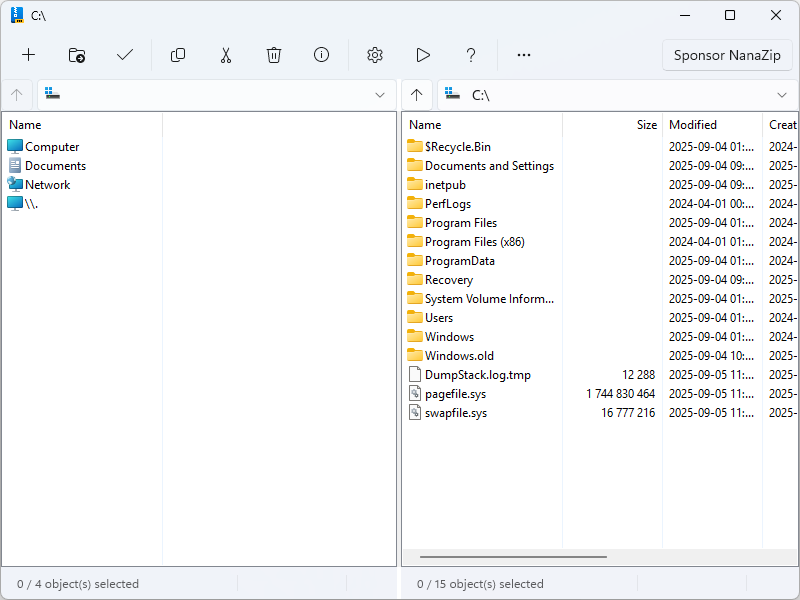

#  NanaZip

NanaZip is an open source file archiver intended for the modern Windows 
experience, forked from the source code of well-known open source file archiver
7-Zip.

**All kinds of contributions will be appreciated. All suggestions, pull 
requests, and issues are welcome.**

If you want to sponsor the development of NanaZip, please read the document of
[NanaZip Sponsor Edition](Documents/SponsorEdition.md). It's free for all
NanaZip source code repository contributors.

In general, NanaZip Sponsor Edition is more like contributor's edition, but
we provide a way to buy the honor and make someone look like a source code
contributor, because NanaZip is always a community-friendly open-source project.

If you'd like me to add features or improvements ahead of time, please use
[paid services](https://github.com/MouriNaruto/MouriNaruto/blob/main/PaidServices.md).

Kenji Mouri

## Features

- Inherit all features from 7-Zip 24.09, [7-Zip ZS] and [7-Zip NSIS].
- Support the dark mode for all GUI components.
- Support the Mica effect on the main window. You will enjoy the full window
  immersive Mica for all GUI components if you are using dark mode with HDR
  disabled.
- Packaging with MSIX for modern deployment experience.
- Support the context menu in Windows 10/11 File Explorer.
- Provide 7-Zip execution alias for helping users to migrate to NanaZip.
- Support the Per-Monitor DPI-Aware for all GUI components.
- Support the i18n for GUI edition of Self Extracting Executable.
- Provide additional hash algorithms.
  - MD2 (Inherit from 7-Zip ZS, but reimplemented with Windows CNG API)
  - MD4 (Inherit from 7-Zip ZS, but reimplemented with Windows CNG API)
  - MD5 (Inherit from 7-Zip, but reimplemented with Windows CNG API)
  - SHA-1 (Inherit from 7-Zip, but reimplemented with Windows CNG API)
  - SHA-256 (Inherit from 7-Zip, but reimplemented with Windows CNG API)
  - SHA-384 (Inherit from 7-Zip, but reimplemented with Windows CNG API)
  - SHA-512 (Inherit from 7-Zip, but reimplemented with Windows CNG API)
  - ED2K (Implemented with Windows CNG API)
  - AICH (Implemented with RHash)
  - BLAKE2b (Implemented with RHash)
  - BTIH (Implemented with RHash)
  - EDON-R 224 (Implemented with RHash)
  - EDON-R 256 (Implemented with RHash)
  - EDON-R 384 (Implemented with RHash)
  - EDON-R 512 (Implemented with RHash)
  - GOST R 34.11-94 (Implemented with RHash)
  - GOST R 34.11-94 CryptoPro (Implemented with RHash)
  - GOST R 34.11-2012 256 (Implemented with RHash)
  - GOST R 34.11-2012 512 (Implemented with RHash)
  - HAS-160 (Implemented with RHash)
  - RIPEMD-160 (Implemented with RHash)
  - SHA-224 (Implemented with RHash)
  - SHA3-224 (Inherit from 7-Zip, but reimplemented with RHash)
  - SHA3-256 (Inherit from 7-Zip, but reimplemented with RHash)
  - SHA3-384 (Inherit from 7-Zip, but reimplemented with RHash)
  - SHA3-512 (Inherit from 7-Zip, but reimplemented with RHash)
  - Snefru-128 (Implemented with RHash)
  - Snefru-256 (Implemented with RHash)
  - Tiger (Implemented with RHash)
  - Tiger2 (Implemented with RHash)
  - BTIH (Implemented with RHash)
  - TTH (Implemented with RHash)
  - Whirlpool (Implemented with RHash)
  - XXH32 (Implemented with xxHash)
  - XXH64 (Implemented with xxHash)
  - XXH3_64bits (Implemented with xxHash)
  - XXH3_128bits (Implemented with xxHash)
  - SM3 (Implemented with GmSSL)
- Provide additional codecs. (Note: Decoder can be considered as decompression
  support, Encoder can be considered as compression support, and Archiver can be
  considered as archive format support)
  - Brotli (Decoder & Encoder & Archiver, inherited from 7-Zip ZS)
  - Fast-LZMA2 (Encoder, inherited from 7-Zip ZS)
  - Lizard (Decoder & Encoder & Archiver, inherited from 7-Zip ZS)
  - LZ4 (Decoder & Encoder & Archiver, inherited from 7-Zip ZS)
  - LZ5 (Decoder & Encoder & Archiver, Both inherited from 7-Zip ZS)
  - Zstandard (Decoder inherited from 7-Zip, Encoder & Archiver inherited from
    7-Zip ZS)
  - NSIS (Decoder's NSIS script decompiling support, inherited from 7-Zip NSIS)
  - UFS/UFS2 file system image (Archiver, read-only, both big and little endian)
  - .NET Single File Application bundle (Archiver, read-only, extracting
    compressed files in the bundle are not supported)
  - Electron Archive (asar) (Archiver, read-only)
  - ROMFS file system image (Archiver, read-only)
  - ZealFS file system image (Archiver, read-only)
  - WebAssembly (WASM) binary file (Archiver, read-only)
  - littlefs file system image (**Work In Progress**) (Archiver, only block
    information can acquired)
- Provide additional security mitigations.
  - Enable Control Flow Guard (CFG) to all target binaries for mitigating ROP
    attacks.
  - Mark all x86 and x64 target binaries as compatible with Control-flow
    Enforcement Technology (CET) Shadow Stack.
  - Strict handle checks at runtime to block the use of invalid handles.
  - Disable dynamic code generation in Release builds prevents generating
    malicious code at runtime.
  - Block loading unexpected libraries from remote sources at runtime.
  - Enable Package Integrity Check.
  - Enable EH Continuation Metadata.
  - Enable Signed Returns.
  - Enable disabling child process creation for NanaZip CLI and Self Extracting
    Executables. (Except installer mode of Self Extracting Executables, which
    compiled binaries is not provided in the NanaZip MSIX package.)

[7-Zip ZS]: https://github.com/mcmilk/7-Zip-zstd
[7-Zip NSIS]: https://github.com/myfreeer/7z-build-nsis

## Differences between NanaZip and NanaZip Classic

NanaZip 3.0 and onwards will have two distribution flavors called NanaZip and
NanaZip Classic. Here are the differences between them.

- NanaZip
  - Only 64-Bit support.
  - Only MSIX packaged version.
  - Support the context menu in Windows 10/11 File Explorer.
  - Support the file associations.
  - Provide 7-Zip execution alias for helping users to migrate to NanaZip.
  - Only support Windows 10 Version 2004 (Build 19041) or later.
  - XAML-based GUI.

- NanaZip Classic (**Work In Progress**)
  - Have 32-Bit support.
  - Only portable version.
  - Don't have the context menu support.
  - Don't have the file associations support.
  - Don't have the 7-Zip execution alias support.
  - Support Windows Vista RTM (Build 6000.16386) or later.
  - Win32 GUI.

## System Requirements

- NanaZip (XAML-based GUI and MSIX package)
  - Supported OS: Windows 10 Version 2004 (Build 19041) or later
  - Supported Platforms: x86 (64-bit) and ARM (64-bit) 

- NanaZip Classic (Win32 GUI)
  - Supported OS: Windows Vista RTM (Build 6000.16386) or later
  - Supported Platforms: x86 (32-bit and 64-bit) and ARM (64-bit)

- NanaZip Core (Core, Codecs, CLI and the Self Extracting Executables)
  - Supported OS: Windows Vista RTM (Build 6000.16386) or later
  - Supported Platforms: x86 (32-bit and 64-bit) and ARM (64-bit)

Note: Except the Self Extracting Executables, the ucrtbase.dll with 10.0.19041.0
version or later need to be existed in the binary folder if you want to use
NanaZip components on Windows versions earlier than Windows 10 Version 2004
(Build 19041).

We chose Windows as the major platform for the NanaZip project supported
because Windows has maintained a good and proven ABI and compatibility, and
stands out in the history of computing. But we also care about the non-Windows
platform. Here are the policy for non-Windows platform support:

- The modern flavor of NanaZip won't support non-Windows unless someone ported
  WinRT XAML to POSIX. So, non-Windows support policy is only for NanaZip Core
  and NanaZip Classic.
- The developer team will try best to support Wine which has the Windows Vista
  or later feature level. Currenly tested simply under Wine 9.x.
- We don't support ReactOS and its derivatives because they are too hard to
  support. But testing under the ReactOS and its derivatives may be interesting.

## Download and Installation

Here are some available installation methods for NanaZip.

### Microsoft Store

This is the recommended way to install NanaZip.

Search and install `NanaZip` in Windows Store for the stable release, and `NanaZip
Preview` for the preview release.

Also, you can also click the Microsoft Store link you needed.

- [NanaZip](https://www.microsoft.com/store/apps/9N8G7TSCL18R)
- [NanaZip Preview](https://www.microsoft.com/store/apps/9NZL0LRP1BNL)

### MSIX Package

You also can download the MSIX Package in 
[GitHub Releases](https://github.com/M2Team/NanaZip/releases).

After you have downloaded the MSIX Package, you can double click to install it,
or you can execute the following command in the PowerShell which is run as 
administrator.

> PowerShell -NoLogo -NoProfile -NonInteractive -InputFormat None -ExecutionPolicy Bypass Add-AppxPackage -DeferRegistrationWhenPackagesAreInUse -ForceUpdateFromAnyVersion -Path `The path of the MSIX package`

Note: All needed dependencies are included in the MSIX Package of NanaZip 
because we known that it's very difficult for users who do not have access to 
the store to get our dependency packages, and we want to be robust and 
deployable everywhere.

If you want to install NanaZip for all users, you can execute the following 
command in the PowerShell which is run as administrator.

> PowerShell -NoLogo -NoProfile -NonInteractive -InputFormat None -ExecutionPolicy Bypass Add-AppxProvisionedPackage -Online -PackagePath `The path of the MSIX package` -LicensePath `The path of the XML license file`

You also can execute the following command in the Command Prompt which is run
as administrator instead.

> DISM.exe /Online /Add-ProvisionedAppxPackage /PackagePath:`The path of the MSIX package` /LicensePath:`The path of the XML license file`

For more information, please read documents for [PowerShell](https://learn.microsoft.com/en-us/powershell/module/dism/add-appxprovisionedpackage?view=windowsserver2022-ps) and 
[DISM](https://learn.microsoft.com/en-us/windows-hardware/manufacture/desktop/dism-app-package--appx-or-appxbundle--servicing-command-line-options?view=windows-11)

Note: Due to the policy from Microsoft Store, you need to run NanaZip with the
internet connection at the first time for getting the license if you install
NanaZip without the internet connection, otherwise Windows won't launch NanaZip
properly.

If you want to uninstall NanaZip you installed for all users, you can execute
the following command in the PowerShell which is run as administrator.

> Get-AppxPackage -Name *40174MouriNaruto.NanaZip* -AllUsers | Remove-AppxPackage -AllUsers -Confirm

## Known issues

- If you can't find NanaZip in the context menu, please restart all File 
  Explorer processes via Task Manager.
- Due to the design of MSIX, drives' context menu in Explorer only show in
  Windows 11(22H2)+.
- Due to the issues in Desktop Bridge file system virtualization, you are 
  unable to use NanaZip in the Safe Mode of Windows.
- Due to the policy from Microsoft Store, NanaZip is unable to disable Desktop 
  Bridge file system virtualization, so the file operations in 
  `%UserProfile%/AppData` will be redirected in Windows 10, and file operations
  in directories other than `Local`, `LocalLow` and `Roaming` in 
  `%UserProfile%/AppData` will still be redirected in Windows 11.
- Due to the Microsoft Store limitations, NanaZip 1.2 and later won't support 
  languages not mentioned in 
  https://docs.microsoft.com/en-us/windows/uwp/publish/supported-languages.
- If you turn off the Windows Firewall, NanaZip may fail to install.
  (https://github.com/M2Team/NanaZip/issues/204)
  (https://github.com/microsoft/terminal/issues/12269)
- Due to the System Settings limitations, starting with Windows 11+ 
  (Build 22000.1817+ & 22621.1555+), you can launch directly to the Settings 
  page for file association for NanaZip.
  (https://learn.microsoft.com/en-us/windows/uwp/launch-resume/launch-default-apps-settings)
- Due to the Microsoft Store Licensing API implementation, you will find NanaZip
  will try to access the Internet beginning with NanaZip 3.0 because NanaZip
  needs to use that to check the Sponsor Edition addon licensing status.
- For optimizing the user experience, NanaZip will only check the Sponsor 
  Edition addon licensing status at the first time your launch NanaZip File
  Manager. You can click the sponsor button if you want to refresh the status
  after you have purchased or redeemed the Sponsor Edition addon.

## Documents

- [License](License.md)
- [Relevant People](Documents/People.md)
- [Privacy Policy](Documents/Privacy.md)
- [Code of Conduct](CODE_OF_CONDUCT.md)
- [Contributing Guide](CONTRIBUTING.md)
- [NanaZip Sponsor Edition](Documents/SponsorEdition.md)
- [NanaZip Release Notes](Documents/ReleaseNotes.md)
- [NanaZip Preview Release Notes](Documents/ReleaseNotesPreview.md)
- [Versioning](Documents/Versioning.md)
- [My Digital Life Forums](https://forums.mydigitallife.net/threads/84171)
