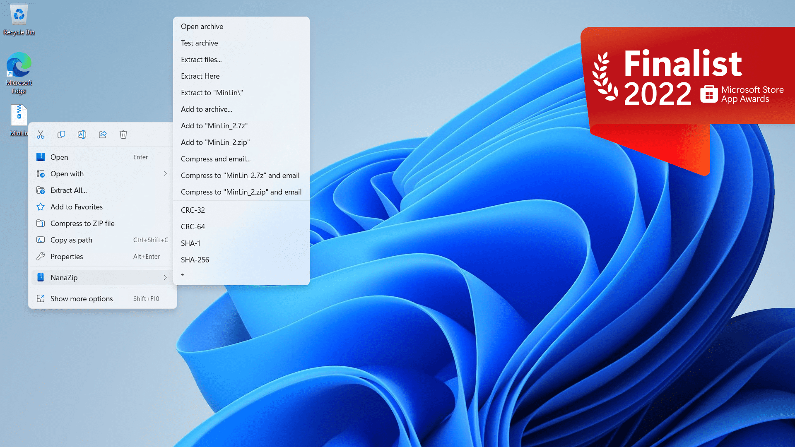

#  NanaZip

**Warning: This project is in early stages of development, the final product 
may differ from what you see now.**

NanaZip is an open source file archiver intended for the modern Windows 
experience, forked from the source code of well-known open source file archiver
7-Zip 21.03.

We need help to translate NanaZip into native languages that have not been 
supported.

# Known issues

- You may meet the application crash in some cases in NanaZip 1.0 Preview 1 and
  NanaZip 1.0 Preview 2 because there are some issues in the exception handler 
  implementation from VC-LTL 5.x. NanaZip 1.0 Preview 3 will be fixed the issue
  because mingkuang (the author of VC-LTL) has releasd the new version of 
  VC-LTL. 
- Windows may show the contrast white icon in the taskbar when you using the 
  contrast standard mode in NanaZip 1.0 Preview 1 and NanaZip 1.0 Preview 2 is 
  fixed the issue.

# Development Roadmap

- 1.x Series (2022 Q2)
  - [x] Modernize the build toolchain with MSBuild for using MSIX packaging and
        parallel compilation support.
  - [x] Use [VC-LTL 5.x](https://github.com/Chuyu-Team/VC-LTL5) toolchain to 
        make the binary size even smaller than the official 7-Zip because we
        can use ucrtbase.dll directly and the optimizations from modern compile
        toolchain.
  - [x] Add the context menu support in Windows 10/11 File Explorer.
  - [x] New icons and minor UI tweaks.
  - [x] Merge [NSIS](https://github.com/myfreeer/7z-build-nsis) support.
        (Suggested by alanfox2000.)
  - [x] Provide 7-Zip execution alias for helping users to migrate to NanaZip. 
        (Suggested by AndromedaMelody.)
  - [ ] Add Per-Monitor DPI-Aware support for Self Extracting Executables.
  - [ ] Try to add codec support for Brotli, Fast-LZMA2, Lizard, LZ4, LZ5 and 
        Zstandard support from [7-Zip ZS](https://github.com/mcmilk/7-Zip-zstd).
        (Suggested by fcharlie.)
  - [ ] Provide NanaZip Deployment Tool for advanced deployment scenarios.
  - [ ] Modernize the i18n implementation and migrate language files from 
        `.txt`  to `.resw`. (Suggested by Maicol Battistini.)
- 2.x Series (2023 Q3)
  - [ ] Modernize the UI with XAML Islands with the Windows 11 control style, 
        Mica material, dark and light mode support.
  - [ ] Full High DPI and Accessibility support in all UI components.
  - [ ] Migrate configurations from registry to json. (Suggested by 
        AndromedaMelody.)
  - [ ] Try to modernize the core implementation.
  - [ ] Try to Windows Runtime component for interoperability.
- 3.x Series (2024 Q3)
  - [ ] Try to add compression support in the graphical user interface for 
        Brotli, Fast-LZMA2, Lizard, LZ4, LZ5 and Zstandard support from 
        [7-Zip ZS](https://github.com/mcmilk/7-Zip-zstd). (Suggested by 
        fcharlie.)
  - [ ] Try to add option for save file names with UTF-8 in 7z archives.
  - [ ] Try to add extension for Windows File Explorer for give user immersive 
        experience. (Suggested by SakuraNeko and shuax.)
  - [ ] Add batch task support. (Suggested by 刘泪.)
  - [ ] Try to design the new UI layout. (Suggested by wangwenx190.)
  - [ ] Try to add option for using Windows Imaging API (WIMGAPI) backend to 
        make better creation and extraction support for wim archives, also add 
        creation and extraction support for esd archives.
  - [ ] Try to add pri archive extracting support.
  - [ ] Try to add smart extraction.
  - [ ] Add language encoding switching support for file names in File Manager.
        (Suggested by 刘泪 and zjkmxy.)
  - [ ] Add deleting source after archiving support. (Suggested by OrionGrant.)
- 4.x Series (2025 Q3)
  - [ ] Try to add recovery record support for 7z archives. (Suggested by 
        SakuraNeko.)
  - [ ] Try to create a new archive format for Windows imaging.
  - [ ] Try to add ISO creation support.

**All kinds of contributions will be appreciated. All suggestions, pull 
requests and issues are welcome.**

# System Requirements

- Supported OS: Windows 10, version 1809 or later
- Supported Platforms: x86, x86-64(AMD64) and ARM64.

# Features

- Packaging with MSIX for modern deployment experience.
- Support the context menu in Windows 10/11 File Explorer.
- Enable parsing the NSIS script support in the NSIS archives.
- Provide 7-Zip execution alias for helping users to migrate to NanaZip.

# Documents

- [License](License.md)
- [Changelog](Documents/Changelog.md)
- [Relevant People](Documents/People.md)
- [Privacy Policy](Documents/Privacy.md)
- [Windows Store](https://www.microsoft.com/store/apps/9N8G7TSCL18R)
- [Code of Conduct](CODE_OF_CONDUCT.md)
- [Contributing Guide](CONTRIBUTING.md)
- [Versioning](Documents/Versioning.md)
- [My Digital Life Forums](https://forums.mydigitallife.net/threads/84171)
