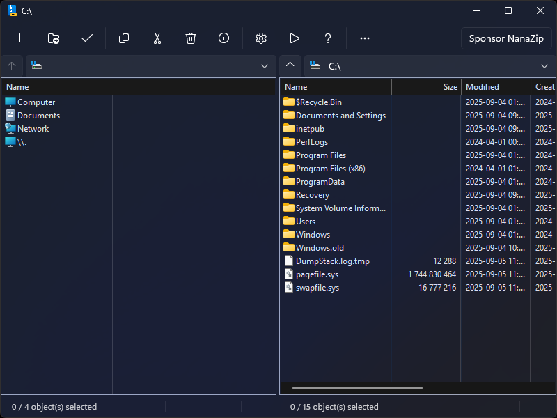

#  NanaZip

[English](README.md)

NanaZip 是一个开源的文件压缩/解压工具，旨在为现代 Windows 用户提供更好的体验，基于知名开源文件归档工具 7-Zip 的源代码进行分支开发。

**欢迎各种形式的贡献。无论是建议、Pull Request 还是 Issue，我们都非常欢迎。**

如果你希望赞助 NanaZip 的开发，请阅读 [NanaZip 赞助版](Documents/SponsorEdition_zh-CN.md) 的相关文档。对于所有 NanaZip 源代码仓库的贡献者，赞助版是免费的。

一般来说，NanaZip 赞助版更像是贡献者专享版，不过我们也提供了一种方式，可以通过购买获得荣誉，让你看起来像是代码贡献者，因为 NanaZip 始终是一个社区友好的开源项目。

如果你希望我优先添加某些功能或改进，请使用[付费服务](https://github.com/MouriNaruto/MouriNaruto/blob/main/PaidServices.md)。

Kenji Mouri

## 功能特色

- 继承自 7-Zip 24.09、[7-Zip ZS] 及 [7-Zip NSIS] 的全部功能。
- 所有图形界面组件均支持深色模式。
- 主窗口支持 Mica 特效。若你使用深色模式且关闭了 HDR，将享受所有界面组件的全窗口沉浸式 Mica 效果。
- 采用 MSIX 打包，带来现代化的部署体验。
- 支持 Windows 10/11 文件资源管理器的右键菜单集成。
- 提供 7-Zip 执行别名，方便用户迁移到 NanaZip。
- 所有图形界面组件均支持每监视器 DPI 感知（Per-Monitor DPI-Aware）。
- 支持自解压格式（SFX）图形界面的国际化（i18n）。
- 现代化的消息框和文件夹选择器。
- 提供智能解压（Smart Extraction）功能。
- 支持“解压后打开文件夹”选项。
- 支持策略机制来强制应用设置（详见 [Policies.md](/Documents/Policies_zh-CN.md)）。
- 默认将“网络标记”（Mark-of-the-Web）传播到所有文件。
- 提供更多哈希算法支持：
  - MD2（继承自 7-Zip ZS，重写为 Windows CNG API 实现）
  - MD4（继承自 7-Zip ZS，重写为 Windows CNG API 实现）
  - MD5（继承自 7-Zip，重写为 Windows CNG API 实现）
  - SHA-1（继承自 7-Zip，重写为 Windows CNG API 实现）
  - SHA-256（继承自 7-Zip，重写为 Windows CNG API 实现）
  - SHA-384（继承自 7-Zip，重写为 Windows CNG API 实现）
  - SHA-512（继承自 7-Zip，重写为 Windows CNG API 实现）
  - ED2K（使用 Windows CNG API 实现）
  - AICH（使用 RHash 实现）
  - BLAKE2b（使用 RHash 实现）
  - BTIH（使用 RHash 实现）
  - EDON-R 224/256/384/512（均使用 RHash 实现）
  - GOST R 34.11-94（使用 RHash 实现）
  - GOST R 34.11-94 CryptoPro（使用 RHash 实现）
  - GOST R 34.11-2012 256/512（均使用 RHash 实现）
  - HAS-160（使用 RHash 实现）
  - RIPEMD-160（使用 RHash 实现）
  - SHA-224（使用 RHash 实现）
  - SHA3-224/256/384/512（继承自 7-Zip，但重写为 RHash 实现）
  - Snefru-128/256（使用 RHash 实现）
  - Tiger/Tiger2（使用 RHash 实现）
  - TTH（使用 RHash 实现）
  - Whirlpool（使用 RHash 实现）
  - XXH32/XXH64/XXH3_64bits/XXH3_128bits（均使用 xxHash 实现）
  - SM3（使用 GmSSL 实现）
- 提供更多编解码器支持。（说明：Decoder 指支持解压缩，Encoder 指支持压缩，Archiver 指支持归档格式）
  - Brotli（解码/编码/归档，继承自 7-Zip ZS）
  - Fast-LZMA2（编码器，继承自 7-Zip ZS）
  - Lizard（解码/编码/归档，继承自 7-Zip ZS）
  - LZ4（解码/编码/归档，继承自 7-Zip ZS）
  - LZ5（解码/编码/归档，均继承自 7-Zip ZS）
  - Zstandard（解码器继承自 7-Zip，编码/归档器继承自 7-Zip ZS）
  - NSIS（解码支持 NSIS 脚本反编译，继承自 7-Zip NSIS）
  - UFS/UFS2 文件系统镜像（归档器，仅限只读，支持大端/小端）
  - .NET 单文件应用程序包（归档器，仅限只读，不支持解压缩包内的压缩文件）
  - Electron Archive (asar)（归档器，仅限只读）
  - ROMFS 文件系统镜像（归档器，仅限只读）
  - ZealFS 文件系统镜像（归档器，仅限只读）
  - WebAssembly (WASM) 二进制文件（归档器，仅限只读）
  - littlefs 文件系统镜像（**开发中**，归档器，仅可获取块信息）
- 提供更多安全加固：
  - 为所有目标二进制启用控制流防护（CFG），缓解 ROP 攻击。
  - 所有 x86 与 x64 目标二进制均标记为支持控制流强制技术（CET）Shadow Stack。
  - 运行时严格句柄校验，阻止无效句柄的使用。
  - Release 版本禁用动态代码生成，防止运行时生成恶意代码。
  - 运行时阻止加载来自远程的意外库。
  - 启用包完整性检查。
  - 启用异常处理（EH）延续元数据。
  - 启用签名返回（Signed Returns）。
  - NanaZip 命令行和自解压文件支持禁止创建子进程（自解压安装模式除外，相关二进制不包含在 NanaZip MSIX 包中）。
- 各类界面 BUG 修复与增强。

[7-Zip ZS]: https://github.com/mcmilk/7-Zip-zstd
[7-Zip NSIS]: https://github.com/myfreeer/7z-build-nsis

## NanaZip 与 NanaZip Classic 的区别

从 3.0 版本起，NanaZip 将提供两种发行版本：NanaZip 和 NanaZip Classic。它们的区别如下：

- NanaZip
  - 仅支持 64 位系统。
  - 仅提供 MSIX 打包版本。
  - 支持 Windows 10/11 文件资源管理器的右键菜单集成。
  - 支持文件关联。
  - 提供 7-Zip 执行别名，方便用户迁移到 NanaZip。
  - 仅支持 Windows 10 Version 2004（Build 19041）及以上系统。
  - 基于 XAML 的图形界面。

- NanaZip Classic（**开发中**）
  - 支持 32 位系统。
  - 仅提供便携版。
  - 不支持右键菜单集成。
  - 不支持文件关联。
  - 不支持 7-Zip 执行别名。
  - 支持 Windows Vista RTM（Build 6000.16386）及以上系统。
  - Win32 图形界面。

## 系统要求

- NanaZip（基于 XAML 的 GUI 和 MSIX 包）
  - 支持系统：Windows 10 Version 2004（Build 19041）及以上
  - 支持平台：x86（64 位）和 ARM（64 位）

- NanaZip Classic（Win32 GUI）
  - 支持系统：Windows Vista RTM（Build 6000.16386）及以上
  - 支持平台：x86（32 位和 64 位）和 ARM（64 位）

- NanaZip Core（核心、编解码器、命令行和自解压文件）
  - 支持系统：Windows Vista RTM（Build 6000.16386）及以上
  - 支持平台：x86（32 位和 64 位）和 ARM（64 位）

注意：除自解压文件外，如果你希望在 Windows 10 Version 2004（Build 19041）之前的版本上使用 NanaZip 组件，需确保二进制文件夹下存在版本号为 10.0.19041.0 或更高的 ucrtbase.dll。

我们选择 Windows 作为 NanaZip 项目的主要支持平台，是因为 Windows 长期保持了良好且经过验证的 ABI 和兼容性，在计算机发展历史中表现突出。但我们也关注非 Windows 平台。以下是针对非 Windows 平台的支持政策：

- NanaZip 的现代版本不会支持非 Windows 平台，除非有人将 WinRT XAML 移植到 POSIX。因此，非 Windows 平台的支持政策仅适用于 NanaZip Core 和 NanaZip Classic。
- 开发团队将尽力支持具备 Windows Vista 及以上功能的 Wine 环境，当前已通过 Wine 9.x 简易测试。
- 我们不支持 ReactOS 及其衍生系统，因为其支持难度较大。但在 ReactOS 及其衍生系统上进行测试也是一件有趣的事。

## 下载与安装

以下是 NanaZip 的多种安装方式。

### 微软商店

这是安装 NanaZip 的推荐方式。

在 Windows 应用商店中搜索并安装 `NanaZip`（稳定版），或 `NanaZip Preview`（预览版）。

你也可以点击下列微软商店链接直接下载安装：

- [NanaZip](https://www.microsoft.com/store/apps/9N8G7TSCL18R)
- [NanaZip Preview](https://www.microsoft.com/store/apps/9NZL0LRP1BNL)

### MSIX 安装包

你还可以在 [GitHub Releases](https://github.com/M2Team/NanaZip/releases) 页面下载 MSIX 安装包。

下载完成后，你可以直接双击 MSIX 文件进行安装，或者以管理员身份运行 PowerShell，执行以下命令安装：

> PowerShell -NoLogo -NoProfile -NonInteractive -InputFormat None -ExecutionPolicy Bypass Add-AppxPackage -DeferRegistrationWhenPackagesAreInUse -ForceUpdateFromAnyVersion -Path `MSIX 安装包的路径`

注意：NanaZip 的 MSIX 安装包已包含所有依赖项，因为我们知道无法访问应用商店的用户很难获取依赖包，我们希望 NanaZip 可以在任何地方都能稳定部署和使用。

如果你希望为所有用户安装 NanaZip，可以以管理员身份运行 PowerShell，执行以下命令：

> PowerShell -NoLogo -NoProfile -NonInteractive -InputFormat None -ExecutionPolicy Bypass Add-AppxProvisionedPackage -Online -PackagePath `MSIX 安装包的路径` -LicensePath `XML 授权文件的路径`

你也可以在以管理员身份运行的命令提示符下执行以下命令：

> DISM.exe /Online /Add-ProvisionedAppxPackage /PackagePath:`MSIX 安装包的路径` /LicensePath:`XML 授权文件的路径`

更多信息请参阅 [PowerShell 文档](https://learn.microsoft.com/zh-cn/powershell/module/dism/add-appxprovisionedpackage?view=windowsserver2022-ps) 和 [DISM 文档](https://learn.microsoft.com/zh-cn/windows-hardware/manufacture/desktop/dism-app-package--appx-or-appxbundle--servicing-command-line-options?view=windows-11)

注意：由于微软商店的政策，离线安装 NanaZip 后，首次运行必须连接互联网以获取许可证，否则 Windows 无法正常启动 NanaZip。

如果你想卸载为所有用户安装的 NanaZip，可以以管理员身份运行 PowerShell，执行以下命令：

> Get-AppxPackage -Name *40174MouriNaruto.NanaZip* -AllUsers | Remove-AppxPackage -AllUsers -Confirm

## 已知问题

- 如果你在右键菜单中找不到 NanaZip，请通过任务管理器重启所有文件资源管理器进程。
- 由于 MSIX 的设计，磁盘驱动器的右键菜单仅在 Windows 11（22H2 及以上）中显示。
- 受限于 Desktop Bridge 文件系统虚拟化机制，NanaZip 无法在 Windows 安全模式下使用。
- 由于微软商店的相关政策，NanaZip 无法禁用 Desktop Bridge 文件系统虚拟化，因此在 Windows 10 中对 `%UserProfile%/AppData` 目录的文件操作将会被重定向，在 Windows 11 中，除 `Local`、`LocalLow` 和 `Roaming` 之外的 `%UserProfile%/AppData` 子目录下的文件操作也同样会被重定向。
- 由于微软商店的限制，从 NanaZip 1.2 及以后版本，将不再支持 [微软官方文档](https://docs.microsoft.com/zh-cn/windows/uwp/publish/supported-languages) 未提及的语言。
- 如果你关闭了 Windows 防火墙，NanaZip 可能无法正常安装。
  ([相关 Issue 1](https://github.com/M2Team/NanaZip/issues/204))
  ([相关 Issue 2](https://github.com/microsoft/terminal/issues/12269))
- 由于系统设置的限制，从 Windows 11+（Build 22000.1817+ & 22621.1555+）起，你可以直接跳转到 NanaZip 的文件关联设置页面。
  ([相关文档](https://learn.microsoft.com/zh-cn/windows/uwp/launch-resume/launch-default-apps-settings))
- 由于微软商店许可 API 的实现，从 NanaZip 3.0 起，你会发现 NanaZip 会尝试访问互联网，因为需要检查赞助版附加组件的授权状态。
- 为优化用户体验，NanaZip 仅会在你首次启动文件管理器时检查赞助版附加组件的授权状态。如果你在购买或兑换赞助版后想要刷新授权状态，可点击赞助按钮进行手动刷新。

## 文档

- [许可证](License.md)
- [相关人员](Documents/People.md)
- [隐私政策](Documents/zh-CN/Privacy.md)
- [行为准则](CODE_OF_CONDUCT.md)
- [贡献指南](CONTRIBUTING.md)
- [NanaZip 赞助者版](Documents/zh-CN/SponsorEdition.md)
- [NanaZip 更新日志](Documents/zh-CN/ReleaseNotes.md)
- [NanaZip 预览版更新日志](Documents/zh-CN/ReleaseNotesPreview.md)
- [版本说明](Documents/Versioning.md)
- [My Digital Life 论坛](https://forums.mydigitallife.net/threads/84171)
